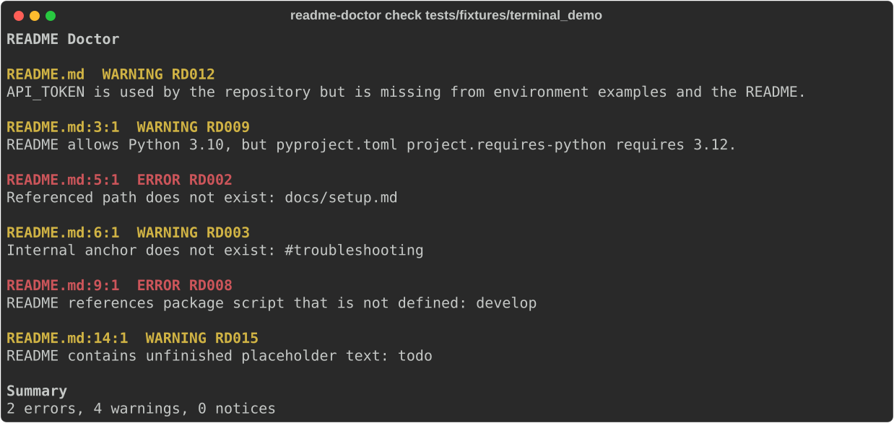

# README Doctor

A README goes stale quietly. A file gets moved and the link that pointed at it keeps looking fine.
A script is renamed in `package.json` but the setup steps still tell people to run the old one. The
project raises its minimum Python version and the installation section keeps promising an older one.
Nobody notices until someone new tries to follow the instructions.

README Doctor reads a repository and compares the README against what is actually there. It reports
broken local links and images, dead heading anchors, missing package scripts, missing referenced
scripts, Python, Node, Dart and Flutter version conflicts, undocumented environment variables, port
mismatches, placeholder text left behind, and a few other things that drift as a codebase changes.

It runs as a command line tool, as a GitHub Action, and as a Python package you can call directly.

## What it does not do

It does not prove that a README is correct. It checks claims that can be compared against files in
the repository, and it stays quiet about everything else. Prose that is simply wrong, steps in the
wrong order, and instructions that only fail on a different operating system are all outside what it
can see.

Several rules are heuristic. Those findings carry a confidence level, explain the evidence they used,
and can be configured or suppressed. Where the evidence is weak, the rule stays silent rather than
guessing. The rules that read project files are described in [docs/rules.md](docs/rules.md).

## Installation

README Doctor requires Python 3.11 or newer.

The package is not published to PyPI yet. Install it from a clone:

```bash
git clone https://github.com/elieh999/readme-doctor
cd readme-doctor
python -m pip install .
```

For development, on Windows PowerShell:

```powershell
python -m venv .venv
.\.venv\Scripts\python -m pip install --upgrade pip
.\.venv\Scripts\python -m pip install -e ".[dev]"
```

On macOS or Linux:

```bash
python -m venv .venv
.venv/bin/python -m pip install --upgrade pip
.venv/bin/python -m pip install -e ".[dev]"
```

## Quick start

Scan the current repository:

```bash
readme-doctor check
```

Scan somewhere else, or change the output:

```bash
readme-doctor check path/to/project
readme-doctor check --format json
readme-doctor check --format sarif --output readme-doctor.sarif
readme-doctor check --strict
readme-doctor check --verbose
readme-doctor check --rule RD002 --rule RD008
```

`check` never writes to the repository it is inspecting.

## Real output

This repository ships a fixture with deliberate documentation problems. Running the tool against it:

```bash
readme-doctor check tests/fixtures/terminal_demo
```

```text
README Doctor

README.md  WARNING RD012
API_TOKEN is used by the repository but is missing from environment examples and the README.

README.md:3:1  WARNING RD009
README allows Python 3.10, but pyproject.toml project.requires-python requires 3.12.

README.md:5:1  ERROR RD002
Referenced path does not exist: docs/setup.md

README.md:6:1  WARNING RD003
Internal anchor does not exist: #troubleshooting

README.md:9:1  ERROR RD008
README references package script that is not defined: develop

README.md:14:1  WARNING RD015
README contains unfinished placeholder text: todo

Summary
2 errors, 4 warnings, 0 notices
```



The screenshot is generated from the reporter itself by `scripts/capture_demo.py`, so it cannot show
anything the command would not print.

Add `--verbose` to see the evidence, the suggested correction, and the confidence for each finding.

## Rules

Twenty one rules ship in 0.1.0. Identifiers are stable within the 0.1 line.

| ID | Default | What it reports |
| --- | --- | --- |
| RD001 | Error | No recognized README at the repository root |
| RD002 | Error | A relative link or image target that is missing, misnamed, or outside the repository |
| RD003 | Warning | A heading anchor that does not exist |
| RD004 | Warning | An image with no alternative text |
| RD005 | Notice | An empty fenced code block |
| RD006 | Warning | An unrecognized or misspelled fence language |
| RD007 | Error | A referenced script, Python module, or Make target that does not exist |
| RD008 | Error | A package script the README names but `package.json` does not define |
| RD009 | Warning | A documented Python minimum below what the project requires |
| RD010 | Warning | The same for Node |
| RD011 | Warning | The same for Dart and Flutter |
| RD012 | Warning | An environment variable used, exemplified, or documented inconsistently |
| RD013 | Warning | A documented port that does not match the published one |
| RD014 | Notice | A configured setup section that is missing |
| RD015 | Warning | Placeholder text such as TODO or lorem ipsum |
| RD016 | Warning | A badge image URL that is not a valid absolute URL |
| RD017 | Warning | A remote link that failed, when network checks are enabled |
| RD018 | Error | A configured verification command that was rejected, failed, or timed out |
| RD019 | Warning | A suppression comment naming an unknown rule |
| RD020 | Notice | Execution was requested but Docker is unavailable |
| RD021 | Notice | A README was found but is not Markdown, so content rules did not run |

Print the registry as JSON with `readme-doctor rules`. Full descriptions and the evidence behind each
rule are in [docs/rules.md](docs/rules.md).

## Configuration

Configuration is optional. Create a starter file:

```bash
readme-doctor init
```

Then pass it when you want it:

```bash
readme-doctor check --config readme-doctor.yml
```

```yaml
version: 1

readme:
  paths:
    - README.md

rules:
  required_sections:
    enabled: true
    severity: notice
    sections:
      - Installation
      - Usage
      - Testing
  remote_links:
    enabled: false
  environment_variables:
    enabled: true
    example_files:
      - .env.example
  disabled:
    - RD016

execution:
  enabled: false
  verify_commands: []

ignore:
  rules: []
  paths:
    - vendor/**
    - build/**
```

YAML is loaded with `yaml.safe_load`. Unknown fields and unknown rule identifiers are errors, not
silent no ops, so a typo tells you about itself. Every field is listed in
[docs/configuration.md](docs/configuration.md).

To silence a finding in one place rather than everywhere:

```markdown
<!-- readme-doctor-disable RD015 -->
TODO kept on purpose as an example
<!-- readme-doctor-enable RD015 -->
```

`readme-doctor-disable-line RD015` covers the following line only. An unknown identifier in a
suppression comment produces RD019.

## GitHub Action

```yaml
name: README Doctor

on:
  pull_request:
  push:
    branches: [main]

permissions:
  contents: read

jobs:
  readme:
    runs-on: ubuntu-latest
    steps:
      - uses: actions/checkout@v4
      - uses: elieh999/readme-doctor@v1
        with:
          format: text
          strict: "true"
```

Inputs are `path`, `config`, `format`, `strict`, `network`, `execute`, `fail-severity`, and
`output-path`. Outputs are `errors`, `warnings`, `notices`, `result`, and `report-path`. Network
checks and command execution both default to false and must be turned on explicitly.

For code scanning, choose `format: sarif`, add `security-events: write`, and upload the report.
Details and a full SARIF workflow are in [docs/github-action.md](docs/github-action.md).

## Output formats

Text is for people. JSON carries the tool version, repository path, README path, findings, summary
counts, execution metadata, scan duration, and the list of enabled rules. SARIF 2.1.0 maps each
finding to a rule descriptor, a severity, and a source location for GitHub code scanning.

Credentials are removed from all three formats. Redaction runs on the report model rather than on
serialized text, so it cannot corrupt a JSON or SARIF document.

## Exit codes

| Code | Meaning |
| --- | --- |
| 0 | No finding reached the failure threshold |
| 1 | A finding reached the failure threshold |
| 2 | Invalid configuration, an unusable path, or a tool error |

The threshold is `error` by default. `--fail-on warning` and `--fail-on notice` lower it, and
`--strict` is the same as `--fail-on notice`.

## Command execution

`--execute` does not run the commands in your README. Nothing in a README is ever treated as
something to execute.

It runs only the commands you list in `execution.verify_commands`, and only when both the
configuration and the `--execute` flag agree. Setting `execution.enabled: true` without the flag runs
nothing. Docker is required. Each command runs in a container with no network, a read only root
filesystem, the repository mounted read only, all Linux capabilities dropped, no new privileges, and
limits on processes, memory, CPU, output size, and time. Known destructive patterns are refused
before anything starts. If Docker is missing the run is skipped and reported as RD020, never silently
moved onto the host.

This is still the highest risk part of the tool. Do not enable it for pull requests from code you do
not control. Read [docs/execution.md](docs/execution.md) and
[docs/security-model.md](docs/security-model.md) first.

## Security model

Ordinary scans do not execute anything, do not reach the network, and do not read `.env`. Relative
references must resolve inside the repository. Directory symlinks are not followed. Virtual
environments, dependency trees, and caches are skipped, which keeps both library internals and their
environment variables out of results.

Redaction covers common token, authorization header, database URL, access key, and private key
shapes. It cannot recognize every secret format, so treat it as a safety net rather than a guarantee.
The full model, including the pull request threat model, is in
[docs/security-model.md](docs/security-model.md).

## Python API

```python
from pathlib import Path

from readme_doctor import DoctorConfig, scan_repository

report = scan_repository(Path("."), DoctorConfig())
for finding in report.findings:
    print(finding.rule_id, finding.severity, finding.message)
```

`DoctorConfig`, `Finding`, `Report`, and `scan_repository` are the public API for 0.1.x. Everything
else, including the parser and the individual checks, is internal and may change. The package ships
`py.typed`, so type checkers see the annotations.

## Windows desktop application

There is a Tkinter interface for people who would rather not use a terminal. Build it from a
development checkout:

```powershell
powershell -ExecutionPolicy Bypass -File scripts\build_windows_app.ps1
```

PyInstaller produces `Application\README Doctor.exe`. That single file needs no Python installation
and no Docker on the machine that runs it. It can pick a repository folder, load a configuration
file, enable remote link checks, apply the strict threshold, and export JSON or SARIF.

Command execution is unavailable from the desktop interface by design. `Application/` is not tracked
in version control, so building it is a local step.

## Local development

```bash
python -m pip install -e ".[dev]"
ruff format --check .
ruff check .
mypy src
pytest
```

Coverage, with the 80 percent gate from `pyproject.toml`:

```bash
pytest --cov=readme_doctor --cov-report=term-missing
```

Regenerate the terminal screenshot after changing the reporter or the demo fixture:

```bash
python scripts/capture_demo.py
```

## Tests

The suite is split into unit tests and command line integration tests. Alongside the usual rule
coverage there are two suites worth knowing about. `tests/unit/test_false_positives.py` holds a
regression for every false positive the checker has produced, because a documentation tool that
reports guesses as facts stops getting used. `tests/unit/test_security.py` covers path containment,
symlink escape, the command policy, malformed Markdown, and the guarantee that no environment value
reaches a report.

Two symlink tests skip on Windows unless developer mode allows unprivileged symlink creation.

## Package build

```bash
python -m build
python -m pip install dist/readme_doctor-0.1.0-py3-none-any.whl
readme-doctor --help
```

## Project structure

```text
src/readme_doctor/
  cli.py          command line interface
  engine.py       runs the checks and assembles the report
  config.py       validated configuration model
  models.py       findings, summary, and report
  parser.py       Markdown parsing and heading anchors
  repository.py   path containment and traversal
  rules.py        the stable rule registry
  checks/         one module per group of rules
  reporters/      text, JSON, and SARIF output
  execution/      opt in command verification and redaction
tests/
  unit/           rules, parser, reporters, security, false positives
  integration/    command line behavior
  fixtures/       valid and invalid sample repositories
docs/             rules, configuration, security model, action, execution
```

## Known limitations

Only Markdown READMEs are analyzed. An `.rst` README is found and reported as RD021 rather than
parsed.

RD007 checks scripts under `scripts/` and `tools/`. A missing `./run.sh` at the repository root is
not reported.

Version detection reads the common declaration files. It does not parse every package manager or CI
syntax, and it compares minimums only.

RD013 needs one unambiguous README port and one published port to say anything.

Remote link results depend on how a site answers an automated request. Rate limits and server errors
are treated as transient rather than as broken links.

Docker execution runs commands against a read only repository with no network, so anything that
installs dependencies or writes to the project tree will not work under it.

Redaction reduces accidental secret exposure. It does not detect every secret format.

## Contributing

See [CONTRIBUTING.md](CONTRIBUTING.md). A new rule needs a stable identifier, a fixture that triggers
it, a fixture that proves it stays quiet when it should, reporter coverage, and a row in
`docs/rules.md`.

## Security reporting

Report a vulnerability privately as described in [SECURITY.md](SECURITY.md). Please do not open a
public issue for anything involving command execution or secret exposure.

## License

MIT. See [LICENSE](LICENSE).
